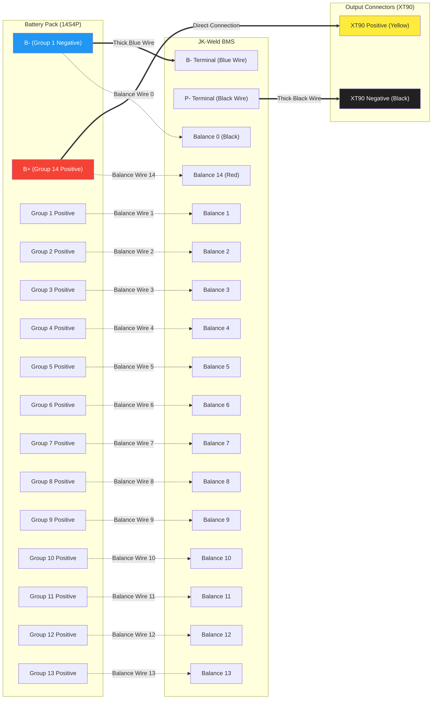
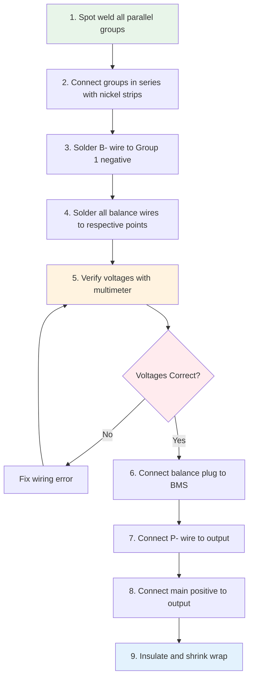
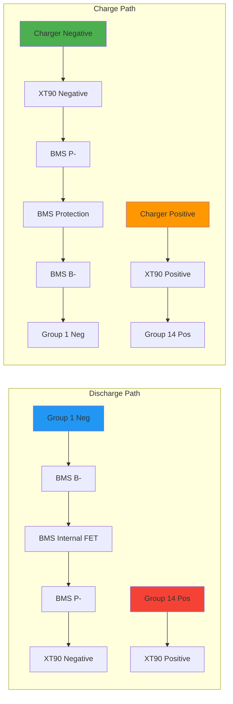

# Detailed Wiring Diagram - 14S4P Battery Pack with JK-Weld BMS

## Physical Layout Diagram

```mermaid
graph TB
    subgraph Pack["14S4P Linear Battery Pack - Physical Layout"]
        direction LR

        subgraph G1["Group 1 (4P)"]
            direction TB
            C1_1((Cell 1))
            C1_2((Cell 2))
            C1_3((Cell 3))
            C1_4((Cell 4))
        end

        subgraph G2["Group 2 (4P)"]
            direction TB
            C2_1((Cell 5))
            C2_2((Cell 6))
            C2_3((Cell 7))
            C2_4((Cell 8))
        end

        subgraph G3["Group 3 (4P)"]
            direction TB
            C3_1((Cell 9))
            C3_2((Cell 10))
            C3_3((Cell 11))
            C3_4((Cell 12))
        end

        subgraph Dots1["..."]
            direction TB
            dots1[Groups 4-12]
        end

        subgraph G13["Group 13 (4P)"]
            direction TB
            C13_1((Cell 49))
            C13_2((Cell 50))
            C13_3((Cell 51))
            C13_4((Cell 52))
        end

        subgraph G14["Group 14 (4P)"]
            direction TB
            C14_1((Cell 53))
            C14_2((Cell 54))
            C14_3((Cell 55))
            C14_4((Cell 56))
        end
    end

    G1 -.->|Nickel Strip| G2
    G2 -.->|Nickel Strip| G3
    G3 -.->|Series Connection| Dots1
    Dots1 -.->|Series Connection| G13
    G13 -.->|Nickel Strip| G14

    style G1 fill:#e3f2fd,stroke:#1976d2
    style G14 fill:#ffebee,stroke:#d32f2f
```

## BMS Wiring Schematic

## Wire Gauge and Connection Table

| Connection Type | Wire Color | Wire Gauge | Purpose | Current Rating |
|-----------------|------------|------------|---------|----------------|
| B- Main | Blue | 10-12 AWG | Main negative to BMS | 30A+ |
| P- Discharge | Black | 10-12 AWG | BMS to XT90 negative | 30A+ |
| Main Positive | Red/Yellow | 10-12 AWG | Group 14 to XT90 positive | 30A+ |
| Balance Wires | Multi-color | 22-24 AWG | Cell voltage monitoring | <1A |
| Nickel Strips | Silver | 0.15-0.2mm | Series connections | 30A+ |

## Physical Assembly Notes

Based on your photos:

1. **Battery Layout**: Linear configuration with cells arranged in a single long line
2. **BMS Position**: Mounted on top of the battery pack, centered
3. **Shrink Wrap**: Blue/teal heavy-duty shrink wrap for protection
4. **Output Connector**: XT90 connector (yellow = positive, black = negative)
5. **Insulation**: Kapton tape visible on connections, fish paper between BMS and cells

## Connection Sequence (CRITICAL)

## Safety Verification Checklist

Before connecting the BMS:

- [ ] All parallel groups show identical voltage (±0.05V)
- [ ] Series connections verified with multimeter
- [ ] Balance wire 0 to wire 1: ~3.6-4.2V
- [ ] Balance wire 0 to wire 2: ~7.2-8.4V
- [ ] Balance wire 0 to wire 3: ~10.8-12.6V
- [ ] Continue pattern for all 14 balance wires
- [ ] Balance wire 0 to wire 14: ~50.4-58.8V (total pack voltage)
- [ ] No shorts between adjacent balance wires
- [ ] All connections insulated with Kapton tape
- [ ] Fish paper installed between BMS and cells

## Current Flow Paths

